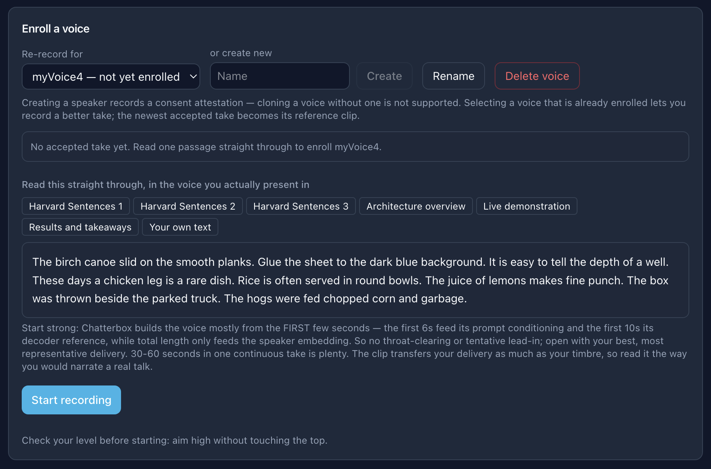
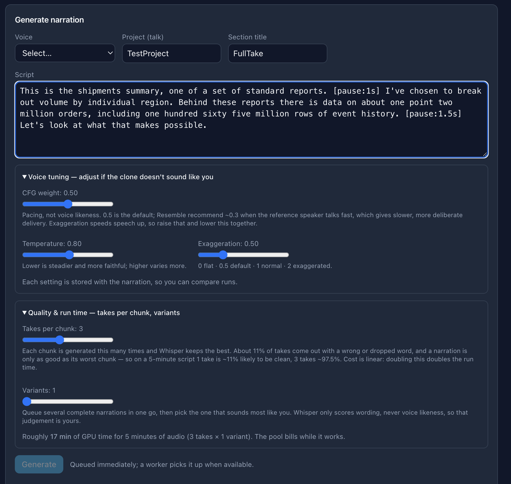
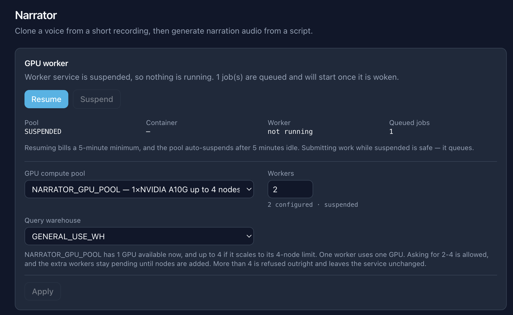

# Narrator

[](LICENSE)
[](https://www.snowflake.com)
[](https://nextjs.org/)

Generates narration audio in an enrolled speaker's voice, for recording over
presentation and demo screen captures. Two Snowflake services: a Next.js UI
deployed as an Application Service, and a GPU worker running
[Chatterbox TTS](https://github.com/resemble-ai/chatterbox) on Snowpark Container
Services.

Everything runs inside Snowflake. The UI never talks to the worker over the
network — it inserts a row into `NARRATOR.APP.JOBS` and the worker polls for it.

---

## What it looks like

**Enrolling a voice.** Creating a speaker records a consent attestation first —
cloning a voice without one is not supported. You then read one passage straight
through. Chatterbox takes the voice mostly from the opening seconds, so the
guidance below the prompt is about opening strongly rather than reading for
length.



**Generating narration.** The script accepts `[pause:1s]` tags, which become true
digital silence inserted at assembly rather than silence asked of the model. Takes
per chunk is the main quality control: each chunk is generated N times and Whisper
keeps the best, which matters because a narration is only as good as its worst
chunk.



**Running the GPU worker.** The worker is suspended by default and costs nothing
while idle. Work submitted against a suspended worker queues rather than failing,
so you can write scripts first and pay for GPU time later.



---

## How voice cloning works here

This section explains how the generated audio comes to resemble a particular
person's voice, and what the application stores in order to achieve it.

The answer to the second question is a single audio file. No model is trained, and
no representation of the voice is retained between generations.

### The reference clip functions as a prompt, not as training data

Voice cloning is commonly assumed to involve supplying a sample of someone's voice,
training for some period, and obtaining a model of that speaker. That is not the
process used here.

Chatterbox was trained once by Resemble AI, across many speakers, to perform a
single task: given a sample of someone talking, produce new text spoken in that
same voice. Those trained weights are fixed and are shipped inside the worker
image. Enrolling a speaker stores one cleaned WAV file and nothing further. At
generation time the file is supplied to the model alongside the script, the model
imitates the voice in it, and no state is retained afterwards.

The speaker's identity therefore resides in the audio file rather than in any set of
weights. This has three consequences for anyone attempting to improve output
quality:

- **Adding a speaker costs one recording, not a training run.** There is no
  per-speaker model to store, version, or load.
- **Quality is bounded almost entirely by that one clip.** Whatever is in it —
  room echo, a head cold, mic hiss — is what gets imitated. This is why
  enrollment applies a hard quality gate rather than accepting any upload.
- **You cannot improve a voice by "training it more".** There is no training. To
  get a better clone you re-record a better reference.

### Text to audio, in three steps

Speech generation does not proceed directly from letters to a waveform. It passes
through an intermediate representation, and that middle stage accounts for most of
the system's observable behaviour.

**Step 1 — Summarise the voice.** A network reads the reference clip and produces
a **speaker embedding**: a list of 256 numbers describing the character of that
voice — its timbre, pitch range, and resonance — with the spoken words discarded.
It functions as a fingerprint of vocal character, and records nothing about what
was said.

**Step 2 — Convert text into sound units.** The model does not predict audio
directly. It instead predicts a sequence of **speech tokens**: discrete symbols
drawn from a fixed inventory of roughly 8,000, each representing a short fragment
of sound. They constitute an alphabet of sounds rather than of letters. The model
produces **25 tokens per second of speech**, so a ten-second sentence corresponds
to approximately 250 tokens.

Predicting tokens one at a time is structurally the same problem as predicting the
next word in a sentence, which is why this step uses a transformer: the same
family of architecture as a text language model, but operating over sound units
instead of words. It reads the script together with the speaker embedding and
produces the token sequence.

**Step 3 — Turn sound units into audio.** A second network converts those tokens
into a **mel spectrogram**, which is in effect an image of the sound: time runs
along one axis, frequency along the other, and brightness indicates how much
energy is present at each point. A spectrogram is considerably easier to predict
than 24,000 individual samples per second, so it serves as an intermediate target.
A final network, termed a **vocoder**, converts the spectrogram into a playable
waveform at 24 kHz.

In the code these three are `VoiceEncoder`, `T3`, and `S3Gen`:

| Step | Module | What it does | Detail |
|---|---|---|---|
| 1 | `VoiceEncoder` | reference clip → speaker embedding | 3-layer LSTM over spectrogram frames plus a linear projection; 256 dimensions, 16 kHz input |
| 2 | `T3` ("text to token") | script + voice → speech tokens | Llama-architecture transformer, ~520M parameters, emits 25 tokens/sec |
| 3 | `S3Gen` | speech tokens → waveform | `CausalMaskedDiffWithXvec` (a flow-matching decoder) produces the spectrogram, then `HiFTGenerator` (a HiFi-GAN vocoder) produces 24 kHz audio |

All three ship as fixed checkpoints from `ResembleAI/chatterbox` on Hugging Face
(`ve.safetensors`, `t3_cfg.safetensors`, `s3gen.safetensors`, `tokenizer.json`,
`conds.pt`) and are baked into the worker image at build time, so a running
worker never downloads weights.

### How the reference clip is used

The single WAV file becomes three separate inputs, and each reads a **different
portion of the recording**. This has direct implications for how long an enrollment
take should be:

| Input | Which part of the clip | Goes to |
|---|---|---|
| `ve_embed` — the 256-number speaker embedding, averaged across the whole recording | all of it, at 16 kHz | Step 2 |
| `cond_prompt_speech_tokens` — up to 150 speech tokens, i.e. the reference clip converted into the same sound-unit alphabet | **first 6 seconds**, at 16 kHz | Step 2, as a prefix |
| `s3gen_ref_dict` — reference spectrogram features | **first 10 seconds**, at 24 kHz | Step 3 |

This arrangement has two practical consequences.

**The voice is supplied twice, in two different forms.** Step 2 gets both the
averaged embedding *and* the opening of the clip re-encoded as actual speech
tokens, placed in front of the tokens it is about to generate — so it is
literally continuing from a sample of that person speaking. That prefix is why
rhythm and intonation carry over, not just tone of voice.

**Only the first 6 and 10 seconds are used** for the prefix and the spectrogram
reference. A 60-second enrollment take is not five times better than a
12-second one; everything past the first 10 seconds only nudges the averaged
embedding. The 12-second minimum exists because below it the clone degrades
audibly — not because longer is proportionally better.

Separately, `exaggeration` is a conditioning input to the model
(`emotion_adv`), not a sampling temperature. It changes what the model is asked
to produce, rather than how randomly it picks.

<details>
<summary><strong>Implementation detail: is step 2 a large language model?</strong></summary>

Not in any useful sense, though it is built from Llama parts. `T3` instantiates
`transformers.LlamaModel` with a config named `Llama_520M`: hidden size 1024, 30
layers, 16 attention heads, head dimension 64, intermediate size 4096, SiLU
activations, llama3-style rotary position embeddings at theta 500,000, bfloat16 —
about 520M parameters.

But it does not process language:

- `vocab_size` in the config is literally `8`, with the comment *"Arbitrary small
  number that won't cause problems when loading. These param are unused due to
  custom input layers."* The real embedding layers are custom ones attached
  either side of the transformer.
- Those custom layers work over two small vocabularies of their own: 704 text
  tokens in, 8,194 speech tokens out. A text LLM's vocabulary is 30,000–200,000.
- Its output is speech tokens, which are meaningless to a language model.

So it borrows Llama's transformer block design and position-encoding scheme.
Another config comment (*"default params needed for loading most pretrained 1B
weights"*) suggests the dimensions were chosen to stay weight-compatible with the
Llama 3.2 family, but whether Resemble initialised from a pretrained text
checkpoint or trained from scratch cannot be determined from this code — the
shipped checkpoint is their own. The accurate description is "a Llama-shaped
sequence model over sound units".

</details>

<details>
<summary><strong>Implementation detail: why a search for "LoRA" returns a match</strong></summary>

LoRA is a technique for cheaply adapting a large model by training a small set of
extra weights. It is a reasonable thing to suspect in a voice-cloning
system, and searching this dependency tree does return a single match. That match
is misleading, for the following reason.

The hit is `LoRACompatibleLinear`, imported from the `diffusers` library in
`models/s3gen/matcha/transformer.py`. It is the standard linear layer class
`diffusers` uses throughout, named for being *able* to host LoRA weights. None
are loaded, none are trained, and no adapter files exist. There is no LoRA, no
adapters, no PEFT, and no per-speaker weights anywhere in this project.

</details>

---

## Enrollment

`ENROLL` job, `handle_enroll` in `worker/worker.py`.

1. User records or uploads a take, stored raw in `@ENROLLMENT_AUDIO`.
2. `adapter.preprocess_enrollment` measures SNR, clipping, silence ratio and
   duration, and writes a normalised copy.
3. `adapter.judge_take` accepts or rejects against fixed thresholds:

   | Check | Threshold | Why |
   |---|---|---|
   | Clipping | ≤ 0.1% of samples at full scale | Audible distortion is cloned faithfully. |
   | SNR | ≥ 20 dB | Room noise becomes part of the voice. |
   | Duration | 12 s – 120 s | Below 12 s the clone degrades noticeably. |
   | Silence ratio | ≤ 45% | Mostly-silence gives the encoder little to work with. |

   Every rejection returns a specific, actionable reason. A bare "rejected" gives a
   user no indication of what to correct in their recording setup.
4. On acceptance the processed WAV is copied to
   `@VOICE_PROFILES/<speaker_id>/reference.wav` and the speaker goes `READY`.

The raw upload is never overwritten — it is this handler's input, so an earlier
version that wrote back to `audio_path` normalised its own output on re-run.

---

## Generation

Each narration is divided into multiple jobs, so that chunks can be generated in
parallel and a failure is confined to the chunk in which it occurred.

```
PLAN ──> GENERATE_CHUNK 0 ─┐
         GENERATE_CHUNK 1 ─┤
         GENERATE_CHUNK 2 ─┼──> ASSEMBLE ──> READY
              ...          ─┘
```

**`PLAN`** splits the script into chunks (`split_into_sentences`, then
`group_sentences(max_chars=300)`), writes one `NARRATION_CHUNKS` row per chunk, and
enqueues a `GENERATE_CHUNK` per chunk plus a single `ASSEMBLE`. The operation is idempotent: it deletes any
existing chunk rows first, so a requeued `PLAN` cannot create duplicates.

**`GENERATE_CHUNK`** generates *n* takes for its chunk, validates each with
Whisper, selects one, and stores it at
`@CHUNK_AUDIO/<narration_id>/<index>.wav` along with its score and gap
measurements. The seed is
`(base_seed + chunk_index * 10007 + attempt * 7919) & 0x7FFFFFFF` — two large
primes, so chunks get uncorrelated seeds and a *retry* of one chunk cannot collide
with another chunk, while the whole narration stays reproducible from one
`base_seed`. The `attempt` term is what allows a repair to produce different audio, as described
below.

**`ASSEMBLE`** does not run until every chunk has reached `READY`. `claim_job`
withholds the job in SQL rather than allowing a worker to claim it and wait. It then applies an 8 ms
fade to both ends of each chunk, generates true digital silence for any pauses,
concatenates, gates, and applies **one** final `loudnorm` pass (I −18, TP −1, LRA
11). Normalising each chunk separately would produce audible changes in level between
them.

Multiple workers can share a narration; each claims whichever chunk jobs are free.

### Per-chunk repair

Generation failures affect individual chunks rather than entire narrations, so
repair regenerates only the affected chunks and re-runs a single `ASSEMBLE`. Every
other chunk retains the audio it already has. Before this, one bad sentence in eighteen meant regenerating all
eighteen — paying for seventeen good chunks and risking that a previously good one
came back worse.

Two entry points:

- **Automatic.** When no take passes Whisper validation for a chunk, the worker
  requeues that chunk with `attempt + 1`, up to `MAX_CHUNK_ATTEMPTS` (3). This is
  considerably cheaper than the alternative, since raising `takes_per_chunk`
  multiplies cost across the entire narration in order to guard against a failure
  that typically affects one chunk in twenty.
- **Manual.** The Chunks panel on each narration lists every chunk with its score
  and state, pre-selects the ones where nothing passed, and regenerates the ticked
  ones.

Two requirements govern this behaviour:

1. **A retry must change the seed.** The seed is derived from
   `(base_seed, chunk_index, attempt)`, so regenerating without incrementing
   `attempt` reproduces byte-identical audio — the "retry" would return the same
   take and a chunk that failed would fail identically. Verified: repairing a chunk
   moved its seed by exactly 7919 and produced a different file (263,118 → 288,078
   bytes, different checksum).
2. **A retry must not destroy the previous take.** Attempt 0 writes
   `<index>.wav`; attempt *n* writes `<index>_a<n>.wav`. A retry is a gamble and can
   come back worse, so the earlier audio is kept and simply stops being referenced
   by the chunk row. It is cleaned up when the narration is deleted.

The system refuses repair requests while a narration has work in flight. The
`ASSEMBLE` job queued by a repair would otherwise race the one already queued, and
could combine a mixture of old and new chunk audio.

### Numbers in the script

Whisper writes spoken numbers as digits, so a script that spells them out mismatches
its own correct audio. This was a real, reproducible failure: the chunk

> "…about **one point two million** orders including **one hundred sixty five
> million** rows of event history."

scored **exactly 0.921** across six independent generations: three retry attempts on
each of two narrations, using different seeds and different exaggeration settings.
Scores identical to three decimal places cannot result from variation in the audio,
which established that the takes were correct and the comparison was at fault. The
defect wasted nine takes per narration.

`worker/numnorm.py` canonicalises numbers on **both** sides before comparison, so
"165 million" and "one hundred sixty five million" both become `165000000`. Applied
symmetrically, so incidental effects ("one of a set" becoming "1 of a set") are
harmless. Verified: the same text now scores **1.0000 on the first attempt**.

Three aspects of the implementation each required correction during development:

1. **Decimals must be protected from punctuation stripping.** The existing normaliser
   removes all punctuation, turning `1.2` into `12` — so "1.2 million" canonicalised
   to twelve million while "one point two million" produced 1.2 million, which was
   worse than the original problem.
2. **Years must not be summed.** "nineteen eighty four" parses as groups 19 and 84;
   adding them gives 103. Two adjacent unscaled groups are rejoined as `1984`.
3. **Numbers are also compared exactly, as an ordered list.** Canonical numbers are
   compact, so `265000000` against `165000000` differs by one character in several
   hundred and scores 0.996 — a misread figure would have passed. A number mismatch
   caps the score at 0.5. That is the worst defect a narration about data can have:
   confident, plausible and invisible.

The preflight lint deliberately does not warn about number formatting. Both
spellings are now safe, and a warning would direct the author to correct something
that is no longer a problem.

Run `python3 worker/test_numnorm.py` for the regression suite.

### Reading chunk scores

The panel distinguishes three states that were previously indistinguishable:

| What you see | Meaning |
|---|---|
| `score 0.997` | A take passed validation at that score. |
| `score 0.912` **plus a failure reason** | No take passed; the best failing take was shipped. This is the one worth repairing. |
| `score not recorded` | No selection metadata at all — the metrics are unknown, not bad. |

The second case previously appeared as a bare `score 0`, indistinguishable from the
third, because the upstream fallback branch loads the best failing candidate and
returns without recording any metadata. Patch edit 11 records it.

### Preflight lint

`lib/script-lint.ts` checks the script as it is typed. Without it, each of the
following problems would only become apparent after a multi-minute GPU run:

| Finding | Severity | Why |
|---|---|---|
| Malformed pause tag (`[pause 2s]`) | error | Does not match the accepted form, so it is **spoken aloud**. |
| Dotted initialism (`A.I.`) | warning | Reads as a sentence end and fragments chunking. |
| Sentence over 300 chars | warning | Cannot be split, so it becomes one oversized chunk — where word dropping concentrates. |
| Sentence near 300 chars | warning | Will likely occupy a chunk of its own, with no room to group. |

Only the malformed pause tag is an error. The remaining findings are warnings and
never block submission, because the model is not deterministic, none of these
patterns is certain to cause a failure, and a single chunk can now be repaired
without regenerating the narration.

### Take selection

Upstream Chatterbox-TTS-Extended selects among validated takes by **shortest
duration**, using the Whisper score only as a pass/fail gate. This is the wrong
criterion: a take that silently omits words is shorter than one that does not, so
selecting for brevity actively favours takes with dropped text. This was the cause
of the "whooshing with missing sentences" failure mode.

`worker/patch_extended.py` replaces the selection with, in order:

1. **Reject non-speech takes.** A take is rejected when it contains a gap longer
   than 1.0 s that is also **less than 25 dB below** the take's own speech level.
   Both conditions are required: long-and-quiet is a legitimate pause, long-and-loud
   is babble. Duration alone would have penalised deliberate pauses.
2. **Highest Whisper score wins.**
3. **Shortest duration, but only among near-ties** (within 0.01 score).

The Whisper score alone is not sufficient. Because the score compares
*transcripts*, non-speech artefacts transcribe to nothing and can still score
1.000. The text score establishes whether the take said all of the required words;
the gap check establishes whether it said only those words.

The patcher applies exact-match assertions against the vendored source at image
build time, so an upstream change breaks the build loudly instead of silently
skipping a patch.

### Pause tags

`[pause:2s]` or `[pause:500ms]` in a script inserts true digital silence, clamped
to a range of 50 ms to 30 s. Pause handling occurs entirely in `worker/planning.py`,
outside the model: each pause is attached to the last chunk of its segment and
inserted during assembly. The vocoder therefore never generates the silence and
cannot introduce a noise floor into it.

Verified end to end: a script with one `[pause:2s]` produced 8592 ms against
8560 ms predicted from chunk durations plus pause.

With no tags present, chunking is byte-identical to the unmodified path.

### auto-editor (off by default)

`auto-editor` removes silence from within generated chunks. It is now safe to
enable, because pauses are inserted by the assembly step and `auto-editor`
therefore only ever processes individual chunk audio, where it cannot remove a
deliberate pause. That limitation was what previously prevented its use.

It remains **disabled by default** because it has a cost. It removes every passage
below its threshold, which includes the model's own quiet phrasing between clauses.
Those short pauses are much of what makes an exaggeration setting of 0.5 sound
conversational rather than recited. Enabling `auto-editor` therefore tightens the
tempo of the entire narration as a side effect of removing hiss from those gaps,
and the `agate` filter in `NARRATOR_DENOISE_FILTER` already attenuates that hiss
without altering timing.

Set `NARRATOR_AUTO_EDITOR=1` in the service spec to try it — env-driven so it needs
an `ALTER SERVICE`, not an image rebuild. `NARRATOR_AE_THRESHOLD` (0.06, roughly
−24 dBFS) and `NARRATOR_AE_MARGIN` (0.2 s kept either side of speech, so cuts do not
clip consonant attacks) tune it.

---

## Compute settings

Set from the GPU card in the UI, stored in `NARRATOR.APP.APP_SETTINGS`.

| Setting | Applied by | Cost |
|---|---|---|
| **GPU compute pool** | `DROP` + `CREATE SERVICE` | Cold start, ~30–60 s. `ALTER SERVICE` **cannot** change a compute pool — it is fixed at create time — so this is the one operation that must recreate the service. Refused while any job is in flight. |
| **Workers** | `ALTER SERVICE SET MIN_INSTANCES = MAX_INSTANCES = n` | Live, no restart. |
| **Query warehouse** | `ALTER SERVICE SET QUERY_WAREHOUSE` + suspend/resume | Restart required: the docs are explicit that this property only takes effect when the service starts. Refused while a job is in flight. |

Only GPU-capable pools are listed. A CPU pool is not merely a slower option for
this workload but an unusable one, so listing it would only produce a failed service
creation.

**Worker count is deliberately not derived from GPU capacity.** A pool's
`MAX_NODES` value is a spending ceiling rather than a target: with `MIN_NODES=1` and
`MAX_NODES=4`, running a single worker most of the time is entirely reasonable. The
UI reports available capacity beside the field instead of inferring a value from
it.

Each worker occupies one GPU, because the service specification requests
`nvidia.com/gpu: 1` per instance. The two capacity limits behave differently:

- Asking for more workers than the pool could **ever** host is **rejected
  outright**. The `ALTER` fails, the service is untouched, and Snowflake's error
  names the instance family, the node limit and both ways to fix it. Nothing goes
  pending.
- Asking for more than are available **right now** but within the node ceiling is
  **accepted**, and the extra instances stay pending while nodes provision.

The warehouse executes only the worker's own bookkeeping queries: job claims,
heartbeats, and row updates. All substantive work happens on the GPU. Increasing
warehouse size therefore provides no benefit, and any existing extra-small warehouse
is sufficient. The project deliberately does not create a dedicated warehouse.

Autoscaling between `MIN_INSTANCES` and `MAX_INSTANCES` is **triggered by CPU
utilisation at 80%**, and will never activate for this workload, which runs at
approximately 10% CPU while holding a GPU at 100%. Both values are therefore set
identically; setting `MAX` above `MIN` would present a control that has no effect. Metric-driven autoscaling policies can scale on a custom
queue-depth metric, which is the approach to investigate if this workload ever needs
to scale automatically.

---

## Operations

Worker image changes:

```bash
docker build --platform linux/amd64 -t <registry>/narrator-worker:vNN worker/
snow spcs image-registry login
docker push <registry>/narrator-worker:vNN
snow sql -q "PUT file://worker/service-spec.yaml @NARRATOR.APP.SPECS OVERWRITE=TRUE AUTO_COMPRESS=FALSE"
snow sql -q "ALTER SERVICE NARRATOR.APP.NARRATOR_WORKER FROM @NARRATOR.APP.SPECS SPECIFICATION_FILE='service-spec.yaml'"
```

Always use `ALTER SERVICE`. Do not drop and recreate the service, except when
changing the compute pool, for which there is no alternative. The worker reaches
`READY` in approximately 50 seconds.

UI changes: `snow app deploy`.

**Suspend the service, not only the compute pool.** A running service holds the pool
in the `ACTIVE` state, and it continues to incur charges.

Two notes on observability. `SYSTEM$GET_SERVICE_LOGS` has a tail limit of 1,000
lines, and **the log buffer is discarded when the service is suspended**, so logs
must be retrieved before suspending rather than afterwards. Worker liveness is
published to the `WORKER_STATUS` table rather than exposed as an HTTP health
endpoint.

Cancellation is cooperative. The worker checks `JOBS.cancel_requested` before each
take, so a cancellation takes effect within a few seconds. The alternative —
stopping the container — would discard a model load costing 30 to 60 seconds.

---

## Schema

`NARRATOR.APP`:

| Object | Purpose |
|---|---|
| `SPEAKERS` | One row per voice. `ref_clip_path` points at the reference WAV. |
| `ENROLLMENT_PROMPTS`, `ENROLLMENT_TAKES` | Read-aloud passages, and takes with their measured quality scores. |
| `NARRATIONS` | Script, speaker, generation settings, final audio path. |
| `NARRATION_CHUNKS` | Per-chunk text, pause, state, audio path, Whisper score, gap measurements, seed, `attempt`, `repair_reason`. Progress and repair both key off these rows. |
| `JOBS` | Work queue. `kind` is one of `ENROLL`, `PLAN`, `GENERATE_CHUNK`, `ASSEMBLE`, plus `ref_id`, `ref_index`, `cancel_requested`. |
| `WORKER_STATUS` | Per-instance heartbeat, phase and progress. |
| `APP_SETTINGS` | Key/value: `gpu_pool`, `worker_count`, `warehouse`. A table rather than a column per setting, so adding one is an INSERT and not a migration. |

Stages (all `SNOWFLAKE_SSE`): `@ENROLLMENT_AUDIO`, `@VOICE_PROFILES`,
`@NARRATION_AUDIO`, `@CHUNK_AUDIO`, `@SPECS`.

Note that **Snowflake does not enforce primary keys**. The primary key declarations
on these tables serve as documentation only. Code must not rely on them to prevent
duplicate rows, which is why writes to `APP_SETTINGS` use `MERGE`.

A single `GENERATE` job kind previously handled an entire narration as one unit. It
was removed rather than left registered, because it had no callers once the
per-chunk fan-out was in place, and an unused second generation path is how two
code paths diverge. Removing it also
surfaced a live bug — the orphan reaper still matched `kind = 'GENERATE'`, so it
could never reset a narration whose `PLAN` had been orphaned, leaving it stuck in
`GENERATING`. It now matches `PLAN`, and deliberately only `PLAN`: a requeued
`GENERATE_CHUNK` or `ASSEMBLE` must leave the narration `GENERATING`, because its
other chunks are still valid.

Worker identity is derived from the container hostname (`narrator-statefulset-0`)
rather than from an environment variable. Every instance of a service shares a
single environment, so a configured `WORKER_ID` would cause all instances to write
heartbeats to the same row. Because the orphan reaper matches on `worker_id`, one
worker's heartbeat would then appear to confirm that another worker's abandoned jobs
were still active.

---

## Working from a fresh clone

Two things are deliberately **not** in this repository, and the worker image will
not build until both are dealt with. A third item lists the values to point at
your own account.

**1. A TLS root certificate, if your network intercepts TLS.**
`worker/snowflake-ca.crt` is specific to your machine and network, so it is
gitignored. Some corporate networks re-sign outbound TLS at a security gateway,
which makes the model downloads in the image build fail with
`CERTIFICATE_VERIFY_FAILED`. If that applies to you, export the intercepting
root from your local trust store before building — on macOS:

```bash
security find-certificate -a -p \
  -c "<your intercepting CA common name>" \
  /Library/Keychains/System.keychain > worker/snowflake-ca.crt
```

**If your network does not intercept TLS, create an empty file** — the
Dockerfile only needs the path to exist:

```bash
touch worker/snowflake-ca.crt
```

**2. `spike/` — the vendored upstream reference.** 1.3 GB of Chatterbox source,
cached model weights, and speaker reference clips. It is **not a build input**:
`worker/Dockerfile` clones the upstream itself at a pinned commit and downloads
the weights during the build, which is also why `snowflake.yml` excludes `spike`
from deploy artifacts. Everything builds without it.

It is only useful for reading upstream source locally — checking that the
anchors in `patch_extended.py` still match, for instance. To restore that copy at
exactly the commit the image uses:

```bash
mkdir -p spike && cd spike
git clone https://github.com/petermg/Chatterbox-TTS-Extended.git
cd Chatterbox-TTS-Extended
git checkout 7b43fc08faa42160208a7e3d0c521a453e59125d
```

Keep that commit in step with `EXTENDED_COMMIT` in `worker/Dockerfile`. If they
drift, the patcher will validate against source the image does not run — and the
patcher asserts on exact anchor strings, so a mismatch fails the build loudly
rather than silently shipping unpatched code.

**3. Values specific to your own account.** The repository ships placeholders
rather than a working account, so set these before deploying:

| Where | What to set |
|---|---|
| `worker/push-to-spcs.sh` | `SNOWFLAKE_CONN` and `REGISTRY`, or override both in the environment. Get the registry host from `SHOW IMAGE REPOSITORIES IN SCHEMA NARRATOR.IMAGES` |
| `snowflake.yml` | `query_warehouse` — currently `GENERAL_USE_WH`; change it to a warehouse you have |
| `sql/01_objects.sql`, `sql/02_presentation_prompts.sql`, `sql/04_service.sql` | the `USE WAREHOUSE` statement at the top |

Everything else — database, schema, service, stage and compute pool names — is
self-consistent within the repository and works unchanged.

**Audio is never tracked.** Voice enrollment clips are biometric data: a
speaker's reference clip is the one artefact that lets anyone reproduce that
cloned voice. Generated narration is app output — derived, re-creatable, and
large. Both live in Snowflake stages (`@ENROLLMENT_AUDIO`, `@NARRATION_AUDIO`,
`@CHUNK_AUDIO`), and `.gitignore` blocks every audio extension so neither can be
committed by accident.

## Codebase notes

Carried over from the scaffold and still true:

- `lib/snowflake.ts` provides `querySnowflake` / `querySnowflakeLongRunning`
  (SPCS OAuth, caller's-rights pooling, local-dev auth) and `getSecret`.
- `next.config.mjs` pins the Next.js workspace root (`turbopack.root` +
  `outputFileTracingRoot`). **Do not remove the pin.** Next.js 16 with Turbopack
  walks upward looking for a lockfile and silently re-roots the project if it finds
  one in a parent directory, which 404s `/` and corrupts `outputFileTracingRoot` at
  deploy time. Merge with the existing object when adding config.
- Deployment config lives in `snowflake.yml`, because `app.yml` has no top-level
  `version: 2`.
- `@tanstack/react-query` is pre-installed; `QueryProvider` wraps the root layout.


## Responsible use

This project clones a person's voice from a short recording, and it is
deliberately easy to use. Two things follow from that.

**Enroll only your own voice, or a voice you have the speaker's explicit
permission to use.** A voice is a biometric identifier, and in several
jurisdictions recording and reproducing one without consent is regulated.
Enrollment audio and generated narration are personal data; they are held in
internal Snowflake stages encrypted with `SNOWFLAKE_SSE`, and this project never
deletes them on your behalf, so apply your own retention policy.

**Generated audio carries no watermark.** Chatterbox can apply Resemble AI's
Perth watermark, which marks output as synthetic and allows later detection.
`worker/adapter.py` passes `disable_watermark=True`, so that mark is absent
here. If you would rather have it, remove that argument in the two places it
appears; the tradeoff is a small imprint on the audio.


## License

MIT — see [LICENSE](LICENSE).

Third-party components and their licences are itemised in [NOTICE](NOTICE),
including the Resemble AI copyright notice that accompanies the upstream source
excerpts in `worker/patch_extended.py`. The summary:

| | |
|---|---|
| Chatterbox TTS, its `ResembleAI/chatterbox` weights, and Chatterbox-TTS-Extended | MIT |
| Whisper (`faster-whisper`, `openai-whisper`) | MIT |
| `auto-editor` | The Unlicense |
| `transformers`, `diffusers`, `gradio` | Apache-2.0 |
| `torch`, `torchaudio` | BSD |

No model weights are gated and none require payment. `NOTICE` records the two
exceptions worth knowing about: `soxr` is LGPL-2.1-or-later, which imposes
nothing on this repository but does carry obligations on anyone redistributing
the **built worker image**, and `pyrnnoise` declares no licence at all.

Contributions are not accepted — see [CONTRIBUTING.md](CONTRIBUTING.md). For
security reporting, see [SECURITY.md](SECURITY.md).


## Disclaimer

THIS SOFTWARE IS PROVIDED "AS IS", WITHOUT WARRANTY OF ANY KIND, EXPRESS OR
IMPLIED, INCLUDING BUT NOT LIMITED TO THE WARRANTIES OF MERCHANTABILITY, FITNESS
FOR A PARTICULAR PURPOSE AND NONINFRINGEMENT. IN NO EVENT SHALL THE AUTHORS OR
COPYRIGHT HOLDERS BE LIABLE FOR ANY CLAIM, DAMAGES OR OTHER LIABILITY, WHETHER
IN AN ACTION OF CONTRACT, TORT OR OTHERWISE, ARISING FROM, OUT OF OR IN
CONNECTION WITH THE SOFTWARE OR THE USE OR OTHER DEALINGS IN THE SOFTWARE.

**This is not an official Snowflake product or offering.** It is an independent
demonstration built on Snowflake's documented features, and it is not endorsed,
supported or maintained by Snowflake Inc. Running it consumes compute in your
own account, GPU compute in particular. Use at your own risk.

